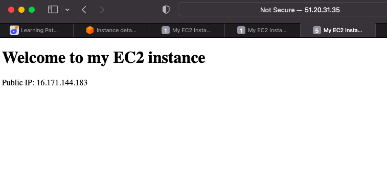

# AUTOLOADBALANCER

The aim of this project is to automate the process of creating loadbalancer by adopting the use shellscripts. In this case, all the instances and connection to remote system ubuntu will be completed manually but the rest will be completed using automation through shellscripting. 

#### Step - 1 Create two instances.

The image below shows Instance 1 created and named `APACHECLB1`

The second instance is created and shown below; `APACHELB2`

For the 2 intances, open port 8000 by editing the inbound rules for both, as shown in the images below

#### Step - 3 Connect the instances

Now that all the instances are set up, they will be connected from the local terminal through `SSH` as shown in the images below. it should be noted that the key should be made viewable before connection is attempted.
Here, the key pair is '`loadruner.pem' and the DNS will be used in the command instead of the IP address

The images below show how the connection for both instances are made.

#### Step - 4 Deploy and configure the webservers

Here a shellscript will be used to complete the process of installing apache and configuring the ports.configuration. To achieve this a `.sh` file will be created and edited to contain the shellcript and executed, as shown in the images below. These will be done for each instance separately.

Now that the scripts are saved in `install.sh` file, ownership/permission will be granted before the scripts can be executed 

The images below show the execution and results for both instances 

The above shows that both webservers are now active.

#### Step - 5 Deploy and configure NGINX Loadbalancer

Now an additional instance will be created and it port will be ameneded to allow traffic from anywhere through port 80.

The images below show the new instance and port

once the instance is created, it is connected via SHH as shown below

After the connection is completed, the NGINX Loadbalancer will be deployed and configured automatically through shellcript. To achive this a file names nginx.sh is created and amended to contain the executable script. This will be run to deploy and configure NGINX as loadbalancer as shown in the images below

#### Step - 6 Verifying the set up

Once the above have been completed successfully, verify the webservers and NGINX loadbalancer  work as they should by typying their IP addresses in the browser. Each webservers should its IP address and the NGINX will show the IP address of the webserver as shown in the images below.

